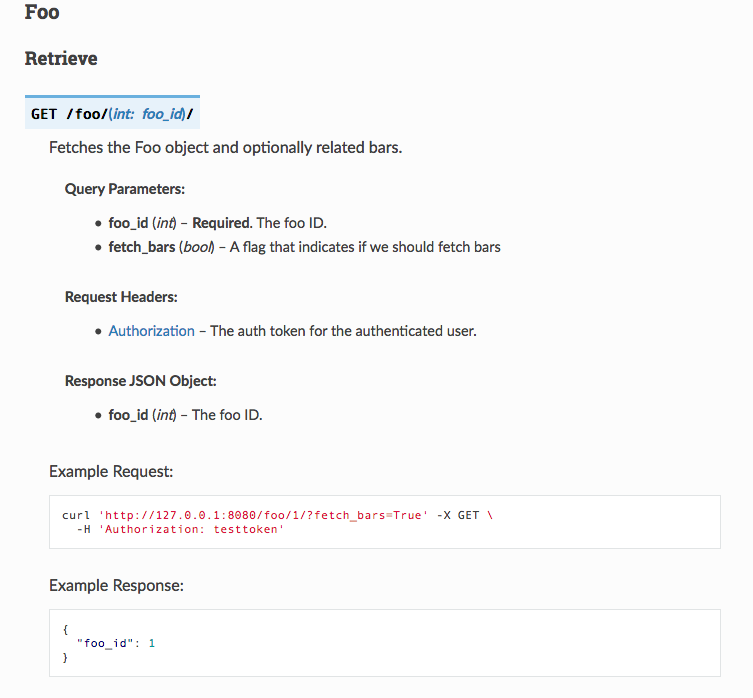

doctor
======
|docs| |build| |pypi|

This module uses python types to validate request and response data in
Flask Python APIs.  It uses `python 3 type hints <https://docs.python.org/3/library/typing.html>`_
to validate request paramters and generate API documentation. It also supports
generic schema validation for plain dictionaries. An example of the generated
API documentation can
be `found in the docs <http://doctor.readthedocs.io/en/latest/flask.html#example-api-documentation>`_.

Install
-------

doctor can easily be installed using pip:

    $ pip install doctor
   
Quick Start
-----------

Define some types that will be used to validate your request parameters.

.. code-block:: python

    # mytypes.py
    from doctor import types

    # doctor provides helper functions to easily define simple types.
    FooId = types.integer('The foo ID.')
    FetchBars = types.boolean('A flag that indicates if we should fetch bars')

    # You can also inherit from type classes to create more complex types.
    class Foo(types.Object):
        description = 'A Foo object'
        example = {'foo_id': 1}
        properties = {'foo_id': FooId}
        required = ['foo_id']
        additional_properties = False

Define the logic function that our endpoint will route to:

.. code-block:: python

    # foo.py
    from mytypes import Foo, FooId, FetchBars

    # Note the type annotations on this function definition. This tells Doctor how
    # to parse and validate parameters for routes attached to this logic function.
    # The return type annotation will validate the response conforms to an
    # expected definition in development environments.  In non-development
    # environments a warning will be logged.
    def get_foo(foo_id: FooId, fetch_bars: FetchBars=False) -> Foo:
        """Fetches the Foo object and optionally related bars."""
        return Foo.get_by_id(foo_id, fetch_bars=fetch_bars)
        
Now tie the endpoint to the logic function with a route:

.. code-block:: python

    from flask import Flask
    from flask_restful import Api
    from doctor.routing import create_routes, get, Route

    from foo import get_foo
   
    routes = (
        Route('/foo/<int:foo_id>/', methods=(
            get(get_foo),)
        ),
    )
    
    app = Flask(__name__)
    api = Api(app)
    for route, resource in create_routes(routes):
        api.add_resource(resource, route)
    
That's it, you now have a functioning API endpoint you can curl and the request is automatically validated for you based on your
schema.  Positional arguments in your logic function are considered required request parameters and keyword arguments are considered
optional.  As a bonus, using the `autoflask <http://doctor.readthedocs.io/en/latest/docs.html>`_ sphinx directive, you will also get
automatically generated API documentation.

   
Documentation
-------------

Documentation and a full example is available at readthedocs_.
   
Running Tests
-------------

Tests can be run with tox_. It will handle installing dependencies into a
virtualenv, running tests, and rebuilding documentation.

Then run Tox:

.. code-block:: bash

    cd doctor
    tox

You can pass arguments to pytest directly:

.. code-block:: bash

    tox -- test/test_flask.py

.. _readthedocs: http://doctor.readthedocs.io/en/latest/index.html
.. _tox: https://testrun.org/tox/latest/

.. |docs| image:: https://readthedocs.org/projects/docs/badge/?version=latest
    :alt: Documentation Status
    :scale: 100%
    :target: http://doctor.readthedocs.io/en/latest/index.html
    
.. |build| image:: https://api.travis-ci.org/upsight/doctor.svg?branch=master
    :alt: Build Status
    :scale: 100%
    :target: https://travis-ci.org/upsight/doctor
    
.. |pypi| image:: https://img.shields.io/pypi/v/doctor.svg
    :alt: Pypi
    :scale: 100%
    :target: https://pypi.python.org/pypi/doctor/
